# ggcompare: Mean Comparison in ‘ggplot2’ <a href="https://github.com/HMU-WH/ggcompare">  </a>

[](https://CRAN.R-project.org/package=ggcompare)
[](https://github.com/HMU-WH/ggcompare/actions/workflows/R-CMD-check.yaml)
[](https://lifecycle.r-lib.org/articles/stages.html#experimental)

## Introduction

This package is a subsection extracted from my personal toolkit.

It was created to improve upon some shortcomings in
[`[0.6.4]ggsignif::geom_signif()`](https://github.com/const-ae/ggsignif/)
and
[`[0.6.0]ggpubr::stat_compare_means()`](https://github.com/kassambara/ggpubr/):

1.  Inability to adapt stably to faceting.
2.  Inability to perform layer-level P-value adjustment (ggpubr can
    achieve panel-level adjustment).
3.  Failure to perform statistical tests smoothly in the absence of some
    groupings. This is often the cause of poor faceting performance.

Usually you do not need to specify the test method, you only need to
tell `stat_compare()` whether you want to perform a parametric test or a
nonparametric test, and `stat_compare()` will automatically choose the
appropriate test method based on your data. For comparisons between two
groups, the p-value is calculated by t-test (parametric) or Wilcoxon
rank sum test (nonparametric). For comparisons among more than two
groups, the p-value is calculated by One-way ANOVA (parametric) or
Kruskal-Wallis test (nonparametric).

## Installation

You can install the released version of `ggcompare` from
[CRAN](https://CRAN.R-project.org/package=ggcompare) with:

``` r
install.packages("ggcompare")
```

## Basic

``` r
library(ggplot2)
library(ggcompare)
```

``` r
p <- ggplot(mpg, aes(class, displ, color = class)) + 
  geom_boxplot(show.legend = FALSE) + 
  theme_test()
```

- Global comparison: Each x has only one group.

``` r
p + stat_compare()
```

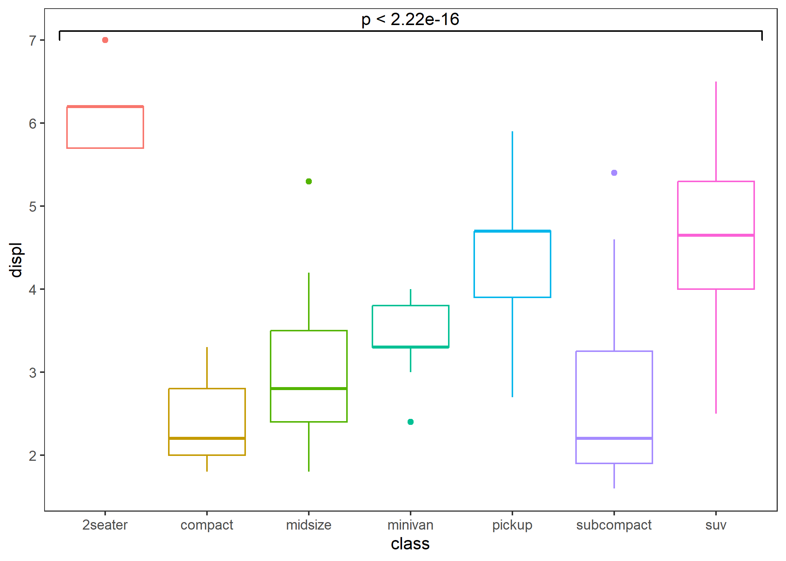

``` r
# If you just want to display text, you can set parameters "bracket" to FALSE.
p + stat_compare(bracket = FALSE)
```

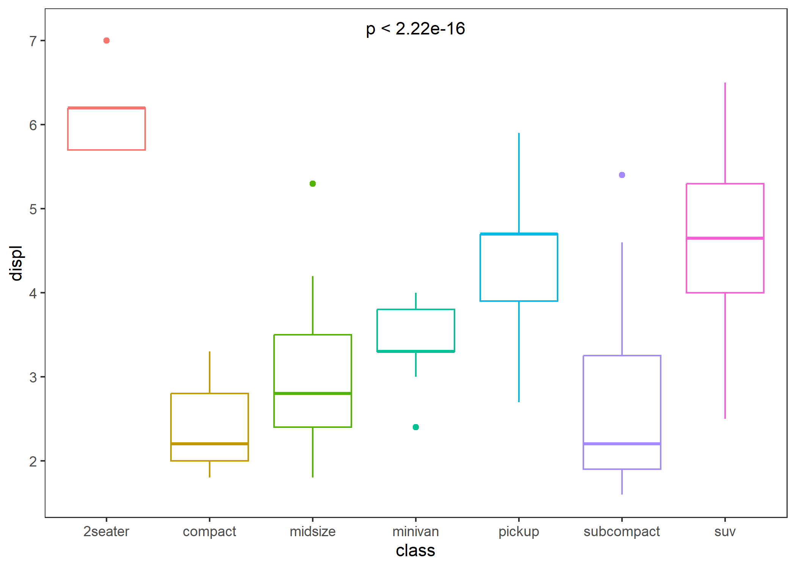

``` r
# If you want to display the test method, you can do this.
p + stat_compare(aes(label = after_stat(sprintf("%s: %s", method, label))))
```

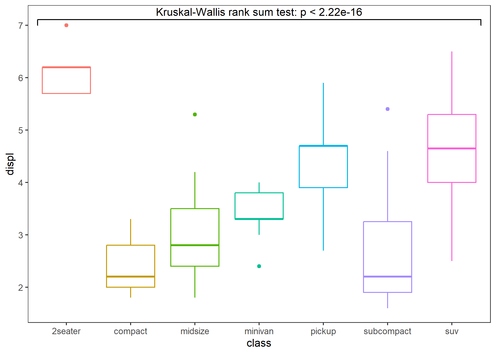

- Comparison between two groups: specify a reference group.

``` r
p + stat_compare(ref_group = "minivan")
```

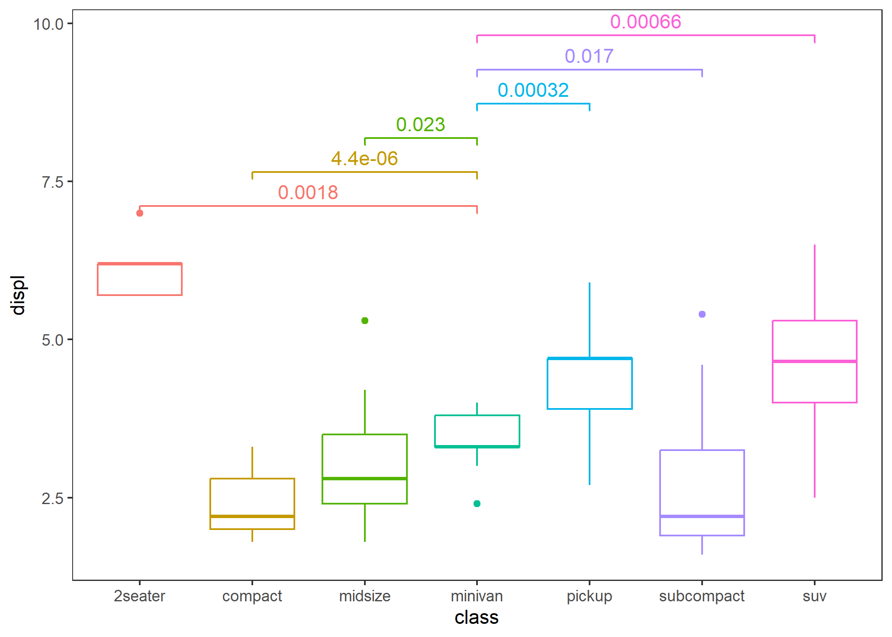

``` r
# If you only want to display the p-value less or equal to 0.01, you can do this.
p + stat_compare(ref_group = "minivan", cutoff = 0.01)
```

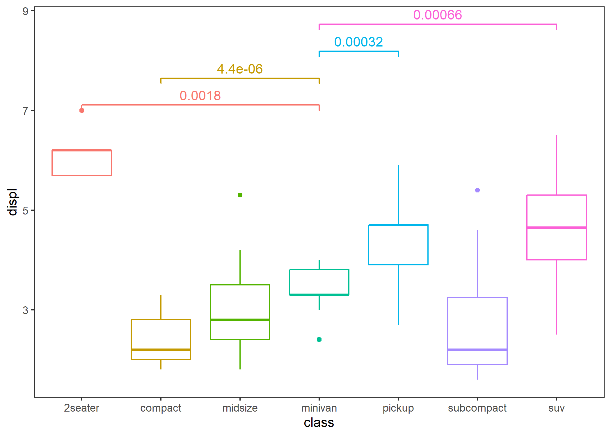

``` r
# if you want to display the significance level, you can do this.
p + stat_compare(ref_group = "minivan", breaks = c(0, 0.001, 0.01, 0.05, 1))
```

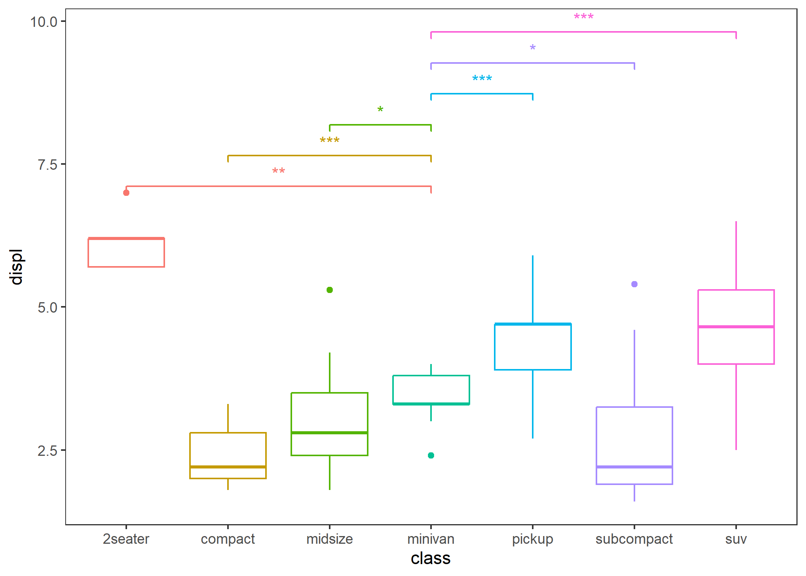

- Comparison between two groups: specify the comparison group.

``` r
p + stat_compare(tip_length = 0.05,
                 step_increase = 0, 
                 comparisons = list(c("compact", "midsize"), c("pickup", "suv")), 
                 arrow = grid::arrow(type = "closed", length = unit(0.1, "inches"))) # Yeah, this supports adding arrows.
```

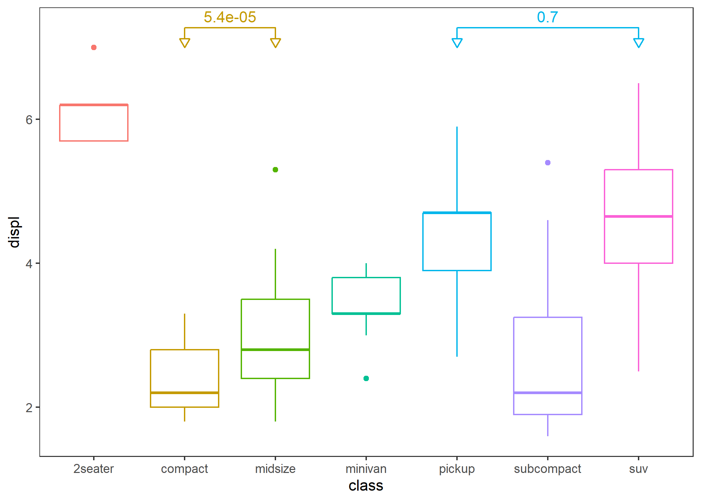

- Within-group (grouped by the x-axis) population comparison.

``` r
ggplot(mpg, aes(drv, displ, fill = class)) +
  geom_boxplot() +
  stat_compare() +
  stat_compare(aes(group = drv), nudge = 0.1, color = "gray") + # add global comparison
  theme_test()
```

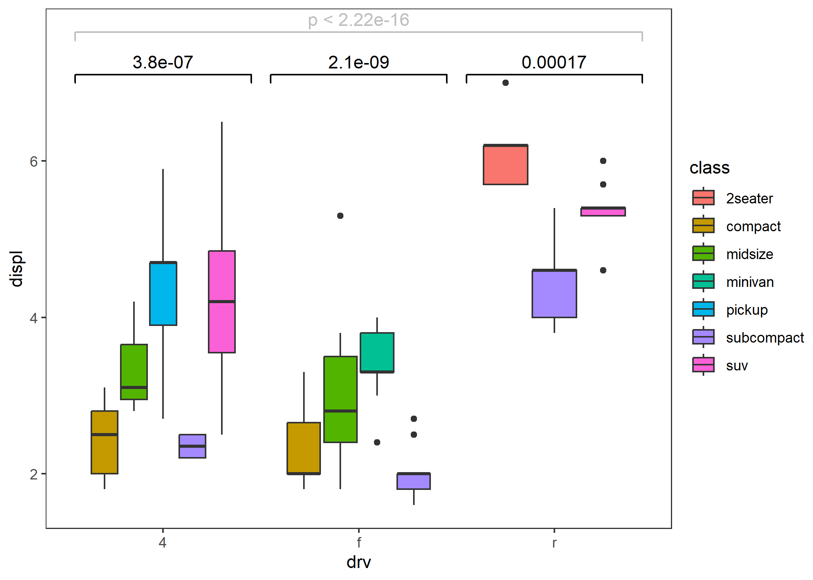

## Enhancement

- Better adaptation to faceting.

``` r
p <- ggplot(mpg, aes(drv, displ)) +
  geom_boxplot() +
  facet_grid(cols = vars(class), scales = "free") +
  theme_test() + 
  theme(plot.title = element_text(size = 20))

comparisons <- combn(unique(mpg$drv), 2, simplify = FALSE)

p1 <- p + stat_compare(comparisons = comparisons) +
  ggtitle("ggcompare::stat_compare")

# missing test information in some panels
p2 <- p + ggsignif::geom_signif(comparisons = comparisons, step_increase = 0.1) +
  ggtitle("ggsignif::geom_signif")
```

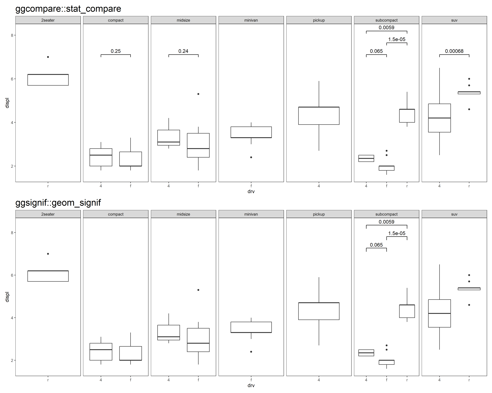

``` r
p <- ggplot(mpg, aes(class, displ)) +
  geom_boxplot() +
  facet_grid(cols = vars(cyl), scales = "free") +
  theme_test() + 
  theme(plot.title = element_text(size = 20),
        axis.text.x = element_text(angle = 45, hjust = 1))

p3 <- p + stat_compare() + ggtitle("ggcompare::stat_compare")

# missing test information in all panels
p4 <- p + ggpubr::stat_compare_means() + ggtitle("ggpubr::stat_compare_means")
```

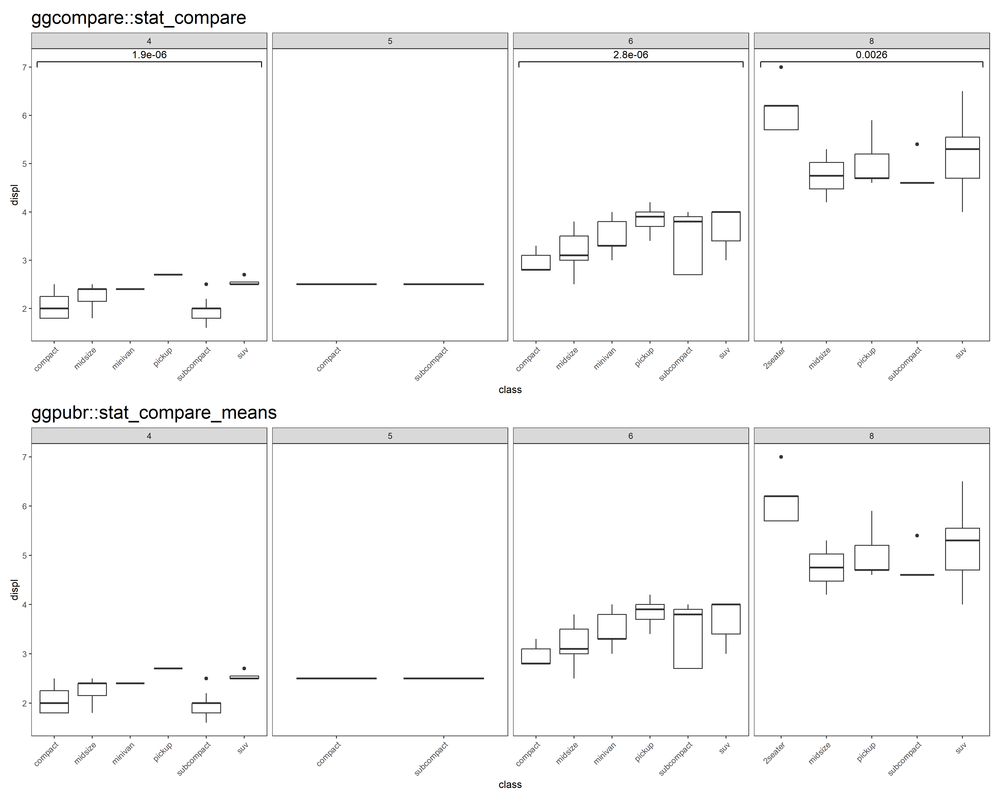

- P-value correction

``` r
# Layer-level
p5 <- p + stat_compare(ref_group = 1, correction = "fdr") + ggtitle("Layer-level P-value adjustment")
# Panel-level
p6 <- p + stat_compare(ref_group = 1, correction = "fdr", panel_indep = TRUE) + ggtitle("Panel-level P-value adjustment")
```

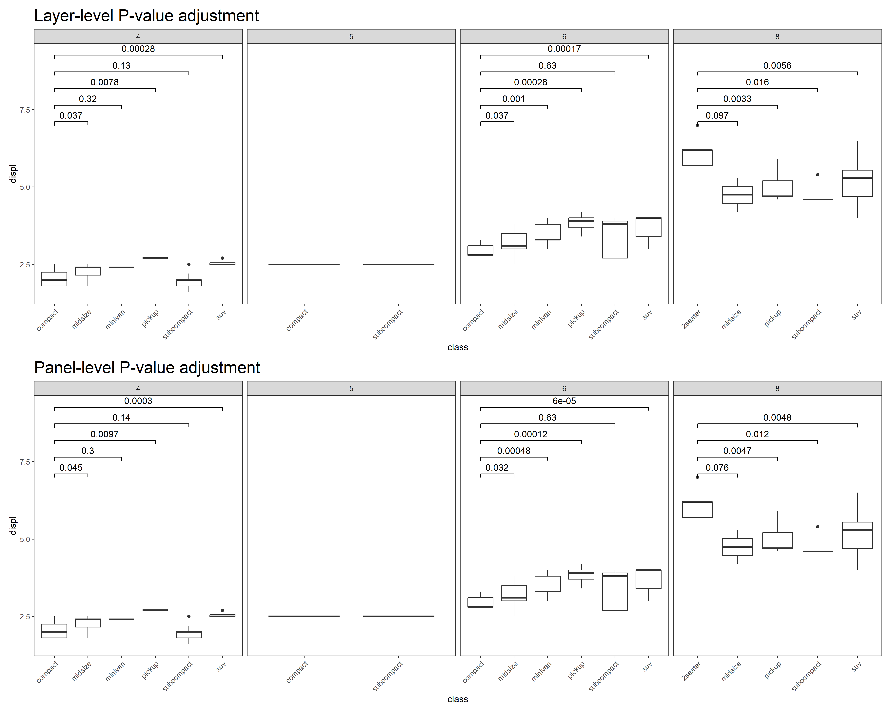
